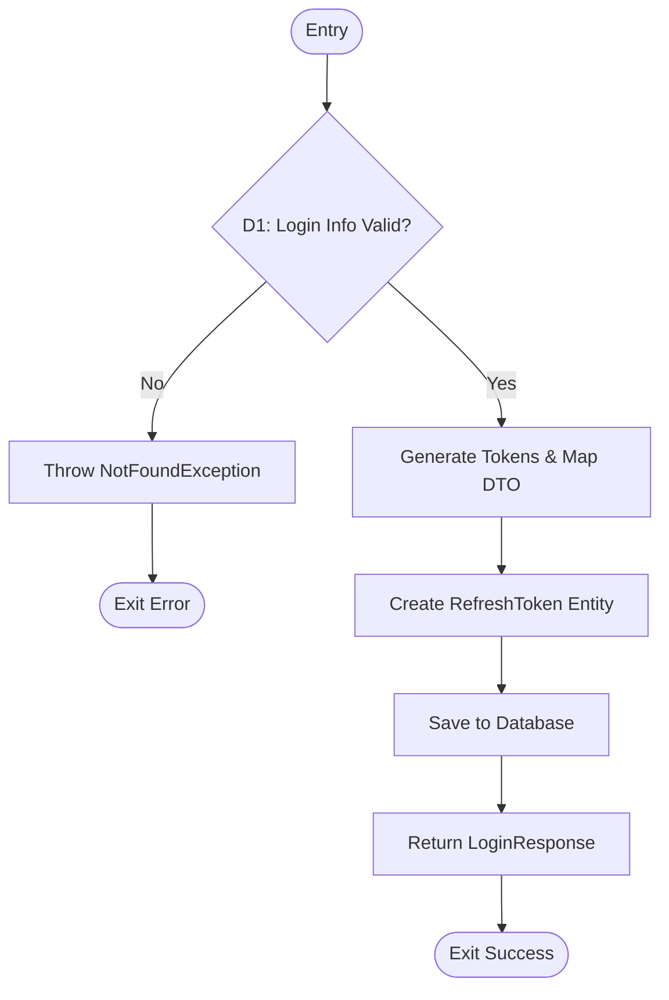

# PHÂN TÍCH CFG - AuthService.LoginAsync

## 1. Sơ đồ luồng điều khiển (CFG)

## 2. Chi tiết các Nút và Nhánh

- **Node 1**: Khởi đầu phương thức, log thông tin.
- **Node 2 (D1)**: Kiểm tra tổ hợp điều kiện:
    - `nguoiDung == null` (Tên đăng nhập không tồn tại)
    - `!VerifyPassword(...)` (Sai mật khẩu)
    - `nguoiDung.TrangThai == false` (Hết hạn/Bị khóa)
- **Node 3**: Xử lý lỗi đăng nhập, ném `NotFoundException`.
- **Node 4-7**: Luồng xử lý thành công: Tạo Token, lưu Refresh Token và trả về kết quả.

---
*TÀI LIỆU KIỂM THỬ PHẦN MỀM LƯU HÀNH NỘI BỘ*
