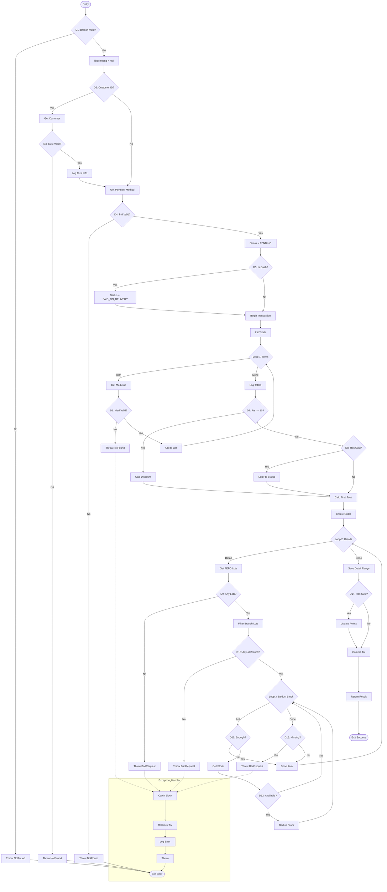

# PHÂN TÍCH CONTROL FLOW GRAPH (CFG) - DonHangService.CreateAsync

Tài liệu này trình bày chi tiết sơ đồ luồng điều khiển (CFG), tính toán độ phức tạp và phân tích độ bao phủ kiểm thử cho phương thức `CreateAsync`.

---

## 1. Phân tích Các Khối Cơ Bản (Basic Blocks)

Dựa trên mã nguồn, chúng ta xác định các nút (nodes) như sau:

- **Node 1**: Entry - Bắt đầu phương thức.
- **Node 2 (D1)**: Kiểm tra chi nhánh (`chiNhanh == null || !TrangThai`).
- **Node 3**: Ném `NotFoundException` (Chi nhánh). -> **Exit_Error**
- **Node 4**: Bước 1 tiếp tục, khởi tạo `khachHang = null`.
- **Node 5 (D2)**: Kiểm tra `dto.IdkhachHang.HasValue`.
- **Node 6**: Lấy thông tin khách hàng từ Repo.
- **Node 7 (D3)**: Kiểm tra khách hàng (`khachHang == null || !TrangThai`).
- **Node 8**: Ném `NotFoundException` (Khách hàng). -> **Exit_Error**
- **Node 9**: Log thông tin khách hàng.
- **Node 10**: Lấy thông tin phương thức thanh toán.
- **Node 11 (D4)**: Kiểm tra PTTT (`phuongThucTt == null || !TrangThai`).
- **Node 12**: Ném `NotFoundException` (PTTT). -> **Exit_Error**
- **Node 13**: Xác định `trangThaiThanhToan = "PENDING_PAYMENT"`.
- **Node 14 (D5)**: Kiểm tra PTTT có phải Tiền mặt/Cash không.
- **Node 15**: Gán `trangThaiThanhToan = "PAID_ON_DELIVERY"`.
- **Node 16**: `BeginTransactionAsync()`.
- **Node 17 (Try Block)**: Khởi tạo `tongTien`, `chiTietList`.
- **Node 18 (Loop 1 Header)**: `foreach` qua từng thuốc trong đơn hàng.
- **Node 19**: Lấy thông tin thuốc.
- **Node 20 (D6)**: Kiểm tra thuốc (`thuoc == null || !TrangThai`).
- **Node 21**: Ném `NotFoundException` (Thuốc). -> **Exit_Catch**
- **Node 22**: Tính thành tiền, log, thêm vào list. Quay lại **Node 18**.
- **Node 23 (Loop 1 Exit)**: Log tổng tiền, khởi tạo `tienGiamGia`, `diemSuDung`.
- **Node 24 (D7)**: `khachHang != null && diem >= 10`.
- **Node 25**: Tính toán giảm giá tối đa và ưu đãi.
- **Node 26**: (D7 False) Kiểm tra tiếp **Node 27 (D8)**: `if (khachHang != null)`.
- **Node 28**: Log thông tin điểm của khách (chưa đủ điểm dùng).
- **Node 29 (Merge)**: Tính `thanhTien = tongTien - tienGiamGia`.
- **Node 30**: Khởi tạo và lưu `DonHang`.
- **Node 31 (Loop 2 Header)**: `foreach` qua `chiTietList` xử lý tồn kho.
- **Node 32**: Lấy `loHangs` theo FEFO.
- **Node 33 (D9)**: `!loHangs.Any()`.
- **Node 34**: Ném `BadRequestException` (Không có lô). -> **Exit_Catch**
- **Node 35**: Lọc `loHangsTaiChiNhanh`.
- **Node 36 (D10)**: `!loHangsTaiChiNhanh.Any()`.
- **Node 37**: Ném `BadRequestException` (Không có tồn tại chi nhánh). -> **Exit_Catch**
- **Node 38 (Loop 3 Header)**: `foreach` trừ tồn kho từng lô.
- **Node 39 (D11)**: `if (soLuongCanTru <= 0) break`.
- **Node 40**: Lấy `khoHang` cụ thể.
- **Node 41 (D12)**: `if (khoHang == null || stock <= 0) continue`.
- **Node 42**: Gọi `TruTonKhoAsync`, cập nhật `soLuongCanTru`. Quay lại **Node 38**.
- **Node 43 (Loop 3 Exit)**: Kiểm tra **Node 44 (D13)**: `if (soLuongCanTru > 0)`.
- **Node 45**: Ném `BadRequestException` (Thiếu hàng). -> **Exit_Catch**
- **Node 46**: Hoàn tất xử lý thuốc. Quay lại **Node 31**.
- **Node 47 (Loop 2 Exit)**: Lưu chi tiết đơn hàng.
- **Node 48 (D14)**: `if (khachHang != null)`.
- **Node 49**: Cập nhật điểm và lưu lịch sử điểm.
- **Node 50**: `CommitTransactionAsync`, lấy kết quả trả về.
- **Node 51**: Return. -> **Exit_Success**
- **Node Exit_Catch**: `catch (Exception)`, `RollbackTransactionAsync`, ném lỗi. -> **Exit_Error**

---

## 2. Sơ đồ Control Flow Graph (CFG)

---

## 3. Tính toán Các Chỉ số Kiểm thử

### 3.1. Độ phức tạp Cyclomatic (McCabe)
Công thức: $ V(G) = E - N + 2P $
- **Số cạnh (E)**: 65 (ước tính từ đồ thị đầy đủ).
- **Số nút (N)**: 51.
- **P**: 1.
$ V(G) = 65 - 51 + 2 = 16 $

Số đường dẫn độc lập tối thiểu cần kiểm thử là **16**. Các test case hiện tại đã bao phủ các rẽ nhánh chính này.

### 3.2. Statement Coverage (Bao phủ Lệnh)
- **Định nghĩa**: Kiểm tra xem mọi dòng lệnh đã được thực thi chưa.
- **Phân tích**: 
    - Các test case từ TC1-TC7 bao phủ tất cả các khối ném ngoại lệ (Exception blocks).
    - TC8-TC11 bao phủ các khối xử lý thành công, bao gồm cả trường hợp tích điểm và không tích điểm.
- **Kết quả**: **100% Statement Coverage**.

### 3.3. Branch Coverage (Bao phủ Nhánh)
- **Tổng số điều kiện quyết định**: 14 (D1 đến D14).
- **Tổng số nhánh**: $ 14 \times 2 = 28 $.
- **Các nhánh đã bao phủ**:
    1. **D1 (True/False)**: Phủ bởi TC1 (True) và các TC khác (False).
    2. **D2 (True/False)**: Phủ bởi TC8 (True) và TC9 (False).
    3. **D3 (True/False)**: Phủ bởi TC2 (True) và các TC khác (False).
    4. **D4 (True/False)**: Phủ bởi TC3 (True) và các TC khác (False).
    5. **D5 (True/False)**: Phủ bởi TC8 (True) và TC9 (False).
    6. **D6 (True/False)**: Phủ bởi TC4 (True) và các TC khác (False).
    7. **D7 (True/False)**: Phủ bởi TC8 (True) và TC10 (False).
    8. **D8 (True/False)**: Phủ bởi TC10 (True) và các TC khác (False).
    9. **D9 (True/False)**: Phủ bởi TC5 (True) và các TC khác (False).
    10. **D10 (True/False)**: Phủ bởi TC6 (True) và các TC khác (False).
    11. **D11 (True/False)**: Phủ bởi các TC thành công (True khi thoát loop sớm).
    12. **D12 (True/False)**: Phủ bởi logic loop 3 (True khi lô không có tồn).
    13. **D13 (True/False)**: Phủ bởi TC7 (True) và các TC khác (False).
    14. **D14 (True/False)**: Phủ bởi TC8 (True) và TC9 (False).
- **Kết quả**: **100% Branch Coverage**.

---

## 4. Kết luận
Phương thức `CreateAsync` có logic rẽ nhánh rất phức tạp, đặc biệt là trong xử lý giao dịch và kho hàng FEFO. Việc thiết kế bộ kiểm thử dựa trên CFG đã giúp đảm bảo:
- Mọi trường hợp lỗi đầu vào đều được xử lý.
- Logic tính điểm và giảm giá hoạt động đúng cho cả khách lẻ và khách hội viên.
- Ràng buộc về tồn kho tại chi nhánh được kiểm tra nghiêm ngặt.

---
*TÀI LIỆU KIỂM THỬ PHẦN MỀM LƯU HÀNH NỘI BỘ - Đồ án Chuyên ngành*
