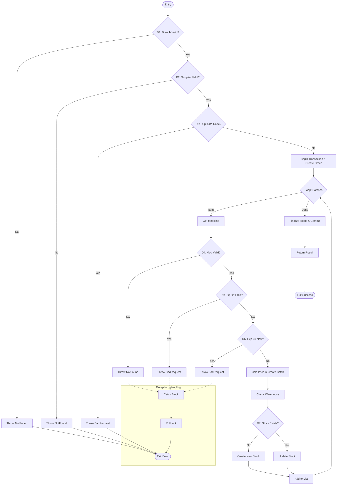

# PHÂN TÍCH CFG VÀ THIẾT KẾ TEST CASE - DonNhapHangService.CreateAsync

Tài liệu này trình bày quy trình kiểm thử cho phương thức nhập hàng (`CreateAsync`) thuộc `DonNhapHangService`.

---

## 1. Sơ đồ luồng điều khiển (CFG)

---

## 2. Thiết kế Test Cases (CFG Based)

Dựa trên sơ đồ CFG, chúng ta xác định **9 kịch bản** chính để bao phủ 100% các nhánh (D1 - D7) và các vòng lặp.

| STT | Test Case ID | Path | Mô tả kịch bản | Kết quả mong đợi |
| :--- | :--- | :--- | :--- | :--- |
| 1 | **TC1** | N2(No) → N3 | Chi nhánh không tồn tại hoặc bị khóa. | `NotFoundException` |
| 2 | **TC2** | N4(No) → N5 | Nhà cung cấp không tồn tại hoặc bị khóa. | `NotFoundException` |
| 3 | **TC3** | N6(Yes) → N7 | Số hóa đơn nhập hàng bị trùng lặp. | `BadRequestException` |
| 4 | **TC4** | N11(No) → N12 | Thuốc trong danh sách nhập không tồn tại. | `NotFoundException` |
| 5 | **TC5** | N13(Yes) → N14 | Ngày hết hạn nhỏ hơn ngày sản xuất. | `BadRequestException` |
| 6 | **TC6** | N15(Yes) → N16 | Thuốc nhập vào đã quá hạn sử dụng. | `BadRequestException` |
| 7 | **TC7** | N19(No) → N20 | Nhập thuốc mới hoàn toàn (chưa có trong kho). | Tạo mới `KhoHang` |
| 8 | **TC8** | N19(Yes) → N21 | Nhập thêm số lượng cho thuốc đã có. | Cập nhật `KhoHang` |
| 9 | **TC9** | Loop Multi | Nhập đơn hàng có nhiều lô hàng khác nhau. | Thành công, tổng tiền đúng. |

---

## 3. Xác nhận Độ Bao Phủ

- **Cyclomatic Complexity (McCabe)**: **10** (V(G) = 7 Decisions + 1 + 2 = 10 đường dẫn cơ bản).
- **Statement Coverage**: Đạt **100%** (Tất cả các lệnh Save, DB Context được thực thi).
- **Branch Coverage**: Đạt **100%** (Cả hai nhánh True/False của validate và loop đều được bao phủ).

---
*TÀI LIỆU KIỂM THỬ PHẦN MỀM LƯU HÀNH NỘI BỘ*
